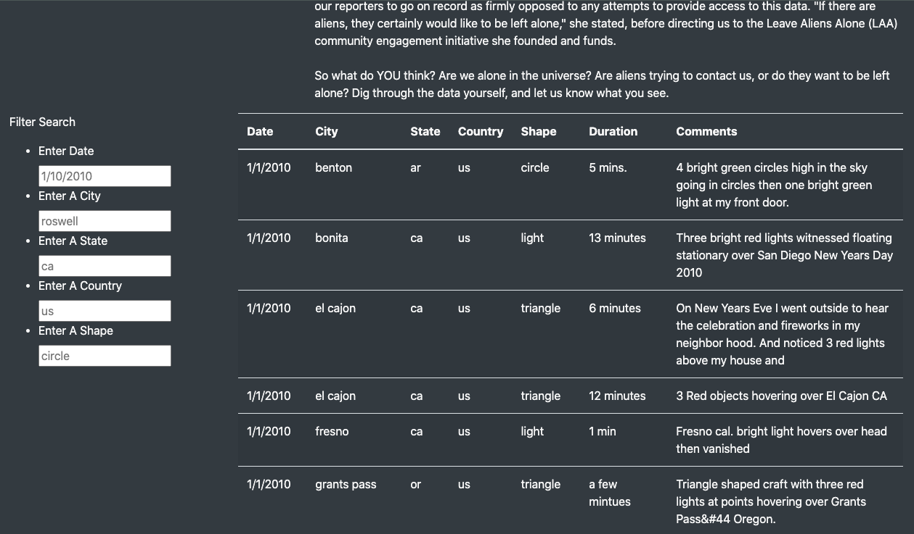
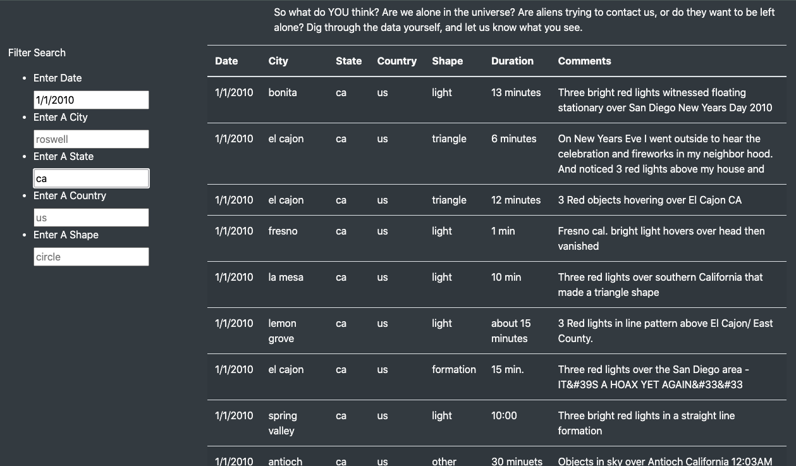

# UFOs

## Background

Dana is interested to complete a project on McMinnville UFO sightings and other related information. She will need to make these sightings easier for people to visually parse by converting them from their current state, a JavaScript array, into an HTML table.

## Overview of Project

Dana's goal is to create an interactive webpage that allows readers to parse the data around UFO sightings. So, she essentially needs to build two things: the webpage that will allow users to view the data (HTML) and a dynamic table that will present it (JavaScript).

Dana wants to storyboard her website to have an idea of what her readers will see when they view the final product.

Once the template has been created, Dana can begin to code the JavaScript portion by first importing the data and then referencing it with a variable.

Data-Driven Documents (D3 for short) is a JavaScript library that adds interactive functionality, such as when users click a button to filter a table. It works by "listening" for events, such as a button click, then reacts according to the code we've created.

### Purpose

Dana’s webpage and dynamic table are working as intended, but she’d like to provide a more in-depth analysis of UFO sightings by allowing users to filter for multiple criteria at the same time. In addition to the date, add table filters for the city, state, country, and shape.

## Analysis And Challenges

Create an interactive website using Javascript to capture user input and return the UFO information according to the filters.

## Methodology: Analytics Paradigm

#### 1. Decomposing the Ask

interactive website with static dataset

#### 2. Identify the Datasource
* data.js

### 3. Define Strategy & Metrics
**Resource:** Javascript, CSS, HTML

#### 4. Data Retrieval Plan

* data given in data.js

#### 5. Assemble & Clean the Data

Dataset is clean:

```
{
  datetime: "1/1/2010",
  city: "benton",
  state: "ar",
  country: "us",
  shape: "circle",
  durationMinutes: "5 mins.",
  comments: "4 bright green circles high in the sky going in circles then one bright green light at my front door."
}
```

#### 6. Analyse for Trends

The dataset is small, limited to 2010 and all UFOs sightings are in US.

#### 7. Acknowledging Limitations

1. There is no new data update from other sources.
2. The dataset only has data from 2010.


#### 8. Making the Call:
The "Proper" Conclusion is indicated below on [Summary](#summary)

## Analysis

When a user first visit the site, the user will see the top fold of the site as seen in Initial View.
>Initial View


Scroll down to see all the information of UFOs sightings. On the left panel, user will see the filtering text fields. To filter the data, user can enter only one of the filter field and press enter.

Here is an example of one filter input with shape as "triangle".

>One Filter



Here is an example of multiple filters input with date as "1/1/2010" and state as "ca".
>Multi Filters



## Summary

### Drawback

One major drawback of this site is that the filter is case sensitive. For example, if we enter state as "CA", it will return nothing in our results.

### Recommendations

1. To work on removing case sensitive issue as stated in drawback above so that user input "CA" in state will also returns results for "ca".
2. To include additional filters for Durations and Comments so users can further filter on the other 2 parameters.
3. To expand and include dataset for other years


## Appendix

* Javascript Objects: https://developer.mozilla.org/en-US/docs/Web/JavaScript/Reference/Global_Objects/Object
